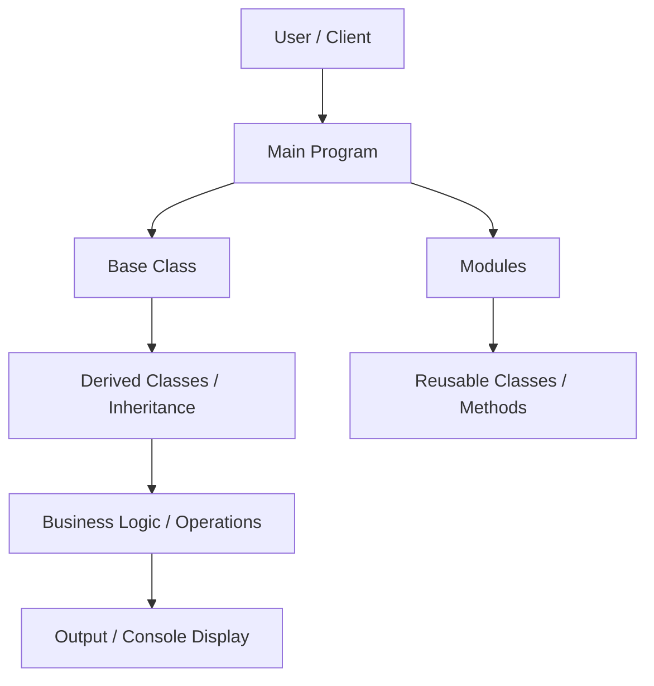

# OOP Concepts Project

## Overview
This project is a standalone TypeScript application built to practice **Object-Oriented Programming (OOP) principles**, including **encapsulation, inheritance, abstraction, and modular class design**. The goal is to develop clean, reusable, and maintainable code while applying best practices.

---

## Architecture & Flow



**Flow Description:**
1. User interacts with the main program.
2. Main program uses base and derived classes to implement logic.
3. Classes are modular and reusable, demonstrating encapsulation and abstraction.
4. Methods perform specific operations and return outputs.
5. The program prints or displays results to the console.

---

## Key Concepts Applied

### 1. Base Class
A **base class** (also called parent class or superclass) is a class that contains common properties and methods that can be shared by other classes.

Example concept:
- Defines common attributes.
- Provides reusable methods.
- Acts as a blueprint for derived classes.

### 2. Derived Class
A **derived class** (also called child class or subclass) extends a base class and inherits its properties and methods.

Key Points:
- Uses `extends` keyword in TypeScript.
- Can reuse base class functionality.
- Can override or add new methods.

### 3. Encapsulation
**Encapsulation** means restricting direct access to certain parts of an object and controlling how data is accessed or modified.

How it is achieved:
- Using `private`, `public`, and `protected` access modifiers.
- Exposing data through getter and setter methods.

Why it matters:
- Protects data integrity.
- Prevents unintended modifications.
- Improves maintainability.

### 4. Inheritance
**Inheritance** allows a class to acquire properties and behaviors from another class.

Benefits:
- Code reusability.
- Reduced duplication.
- Clear hierarchical structure.

### 5. Abstraction
**Abstraction** means hiding implementation details and exposing only essential functionality.

How it is achieved:
- Using abstract classes or interfaces.
- Defining method signatures without exposing internal logic.

Why it matters:
- Reduces complexity.
- Improves scalability.
- Makes code easier to extend.

### 6. Polymorphism
**Polymorphism** allows methods to behave differently based on the object that calls them.

Types:
- Method overriding (same method name, different implementation).
- Method overloading (same method name, different parameters).

Why it matters:
- Increases flexibility.
- Enables dynamic behavior.

---

## Features
- Practice OOP principles in TypeScript.
- Modular, reusable, and maintainable code.
- Easy to extend with new classes and features.
- Demonstrates separation of concerns and clean design.

---

## Installation & Usage
1. Clone the repository:
```bash
git clone https://github.com/SrideviMR/Oops.git
```
2. Navigate to the project directory:
```bash
cd Oops
```
3. Install dependencies:
```bash
npm install
```
4. Build the TypeScript project:
```bash
npm run build
```
5. Run the program:
```bash
npm start
```
6. Observe the outputs in the console.

---

## Learnings
- Applying OOP principles in a practical project.
- Designing modular and reusable TypeScript classes.
- Understanding inheritance and abstraction in depth.
- Writing clean code with separation of concerns.
- Structuring a project for scalability and maintainability.

---

## GitHub
[OOP Concepts Project Repository](https://github.com/SrideviMR/Oops)
