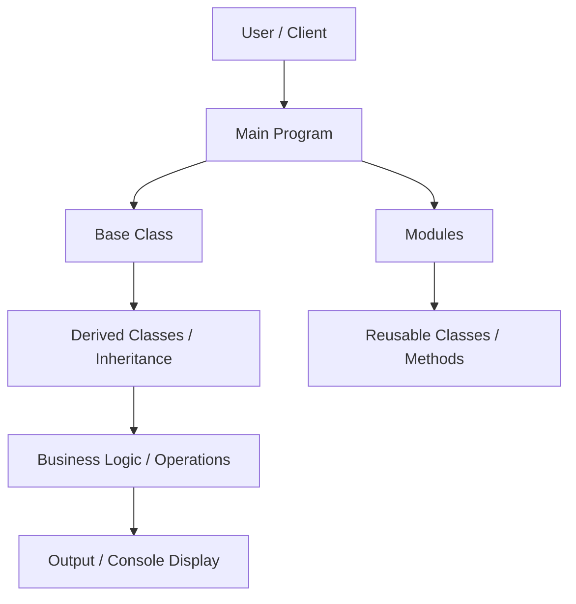

# OOP Concepts Project

## Overview
This project is a standalone TypeScript application built to practice **Object-Oriented Programming (OOP) principles**, including **encapsulation, inheritance, abstraction, and modular class design**. The goal is to develop clean, reusable, and maintainable code while applying best practices.

---

## Architecture & Flow



**Flow Description:**
1. User interacts with the main program.
2. Main program uses base and derived classes to implement logic.
3. Classes are modular and reusable, demonstrating encapsulation and abstraction.
4. Methods perform specific operations and return outputs.
5. The program prints or displays results to the console.

---

## Key Concepts Applied
- **Encapsulation**: Private and public members to protect data.
- **Inheritance**: Derived classes extend base classes to reuse code.
- **Abstraction**: Classes and methods hide internal implementation details.
- **Modular Design**: Code organized into separate files and modules.
- **Clean Code**: Meaningful naming, separation of concerns, and readability.

---

## Features
- Practice OOP principles in TypeScript.
- Modular, reusable, and maintainable code.
- Easy to extend with new classes and features.
- Demonstrates separation of concerns and clean design.

---

## Installation & Usage
1. Clone the repository:
```bash
git clone https://github.com/SrideviMR/Oops.git
```
2. Navigate to the project directory:
```bash
cd Oops
```
3. Install dependencies:
```bash
npm install
```
4. Build the TypeScript project:
```bash
npm run build
```
5. Run the program:
```bash
npm start
```
6. Observe the outputs in the console.

---

## Learnings
- Applying OOP principles in a practical project.
- Designing modular and reusable TypeScript classes.
- Understanding inheritance and abstraction in depth.
- Writing clean code with separation of concerns.
- Structuring a project for scalability and maintainability.

---

## GitHub
[OOP Concepts Project Repository](https://github.com/SrideviMR/Oops)
